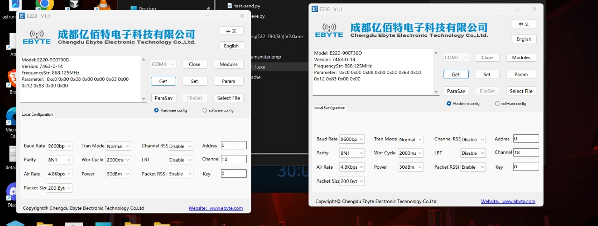

### A LoRA Transreceiver based on STM32 F303RE , Ebyte's E220-900T30D LoRA module 


---

### Pinout 
####  TX (Transmitter)

| Stm32 | Lora |
| ----- | ---- |
| PC4   | TX   |
| PC5   | RX   |
| 3V3   | VCC  |
| GND   | GND  |


#### RX (Receiver with OLED Display)
 
| Stm32 | Lora (UART) | SH1106 (I2C) |
| ----- | ----------- | ------------ |
| PC4   | --> TX      |              |
| PC5   | -->  RX     |              |
| 3V3   | -->  VCC    | -->   VCC    |
| GND   | -->  GND    | -->   GND    |
| PA10  |             | -->   SDA    |
| PA9   |             | -->   SCL    |

### Implementation Details

#### Transmitter
The transmitter code implements a simple periodic transmission system:
- Uses UART1 at 9600 baud to communicate with the E220 LoRa module
- Sends packets with a counter value that increments with each transmission
- Format: `CNT:X` where X is the counter value
- Transmits every 3 seconds
- Uses the onboard LED (LD2) to indicate transmission

```c
// Example of transmitter packet format
int payloadLen = snprintf((char*)rawBuf, MAX_PAYLOAD, "CNT:%lu", counter);
HAL_UART_Transmit(&huart1, rawBuf, payloadLen, 1000);
```

#### Receiver
The receiver implements:
- UART1 at 9600 baud for LoRa module communication
- I2C2 interface for SH1106 OLED display
- UART2 at 115200 baud for debug messages via printf
- Packet structure parsing: [AddrHi][AddrLo][Channel][Payload...][RSSI]
- OLED display showing received messages and signal strength
- LED indication of received packets

```c
// Receiver packet processing
uint8_t addrHi = rxTemp;
uint8_t addrLo = rxTemp;
uint8_t channel = rxTemp;
// ...payload bytes...
uint8_t rssi_raw = rxBuffer[payloadLen - 1];
```

#### RSSI Calculation
The E220-900T30D module automatically appends an RSSI (Received Signal Strength Indicator) byte to each received packet. This feature provides valuable signal quality information:

- The last byte in each received packet contains the raw RSSI value
- Raw RSSI is converted to dBm using the formula: `-120 + (rssi_raw * 0.5f)`
- Lower dBm values (more negative) indicate weaker signals
- Typical range: -60 dBm (excellent) to -120 dBm (very poor)

```c
// RSSI conversion from raw to dBm
uint8_t rssi_raw = rxBuffer[payloadLen - 1];
int rssi_dBm = -120 + (rssi_raw * 0.5f);

// Example display on OLED
char rssiString[20];
sprintf(rssiString, "RSSI: %d dBm", rssi_dBm);
SH1106_GotoXY(0, 30);
SH1106_Puts(rssiString, &Font_7x10, 1);
```

The RSSI value is useful for:
- Determining optimal antenna placement
- Estimating maximum communication range
- Troubleshooting connection issues
- Implementing adaptive data rate features

### System Architecture


Reference Stm32 F303RE Pinout


### Lora Manufacturer on board configuration via USB TTL Adapter

